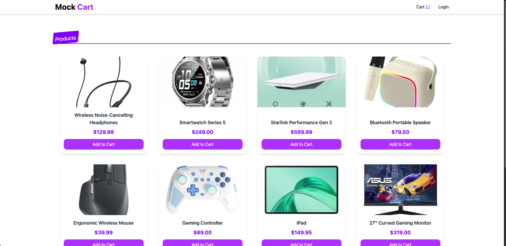
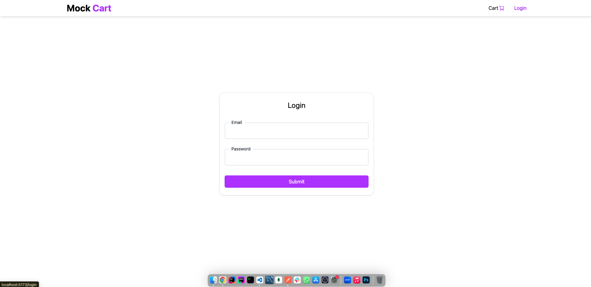
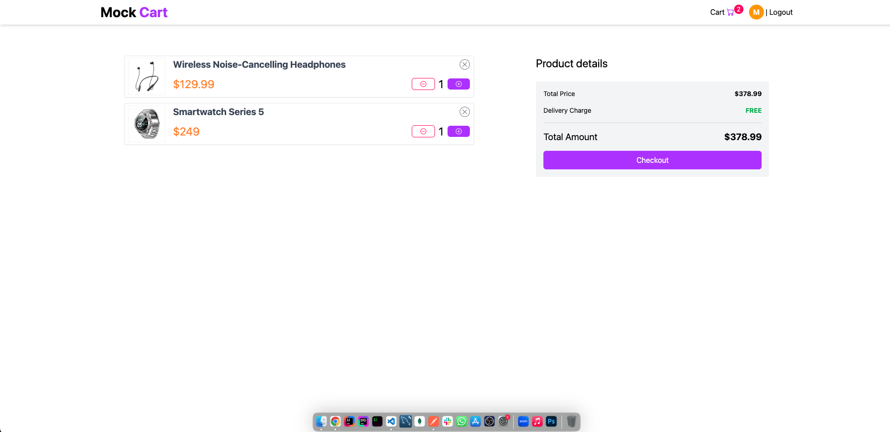
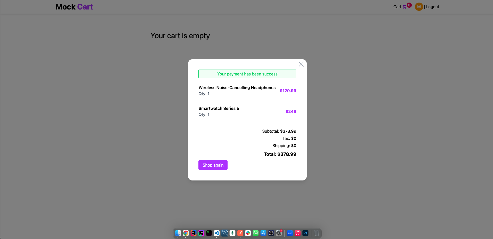

# 🛒 Mock Cart

A full-stack **MERN (MongoDB, Express, React, Node.js)** application for an e-commerce platform with user authentication, product listings, a shopping cart, and order generation after checkout.

---

## 🚀 Features

### 🧑‍💻 Frontend (React + Tailwind CSS)

-   Product listing with image, name, and price
-   Beautiful hover effects with overlay and scaling
-   Add to Cart / Remove from Cart functionality
-   Real-time cart quantity updates
-   Order summary generation after checkout
-   Loader and state management using Context API
-   Responsive, modern UI built with **Tailwind CSS**

### ⚙️ Backend (Node.js + Express + MongoDB)

-   User authentication and model (`User` schema)
-   Product management with image, price, and name
-   RESTful API routes for:
    -   Add to Cart
    -   Increment/Decrement Cart Item
    -   Checkout (order summary generation)
-   MongoDB models with Mongoose
-   Error-handling with `express-async-handler`
-   Clean and modular route/controller structure

---

## ⚡ Setup Instructions

```bash
1️⃣ Clone the repository
git clone https://github.com/habib610/mock-cart.git
cd mock-cart


2️⃣ Install dependencies
# backend
cd backend
yarn install

# frontend
cd ../frontend
yarn install


3️⃣ Create a .env file in /backend
MONGODB_CONNECTION_URI=your_mongodb_connection_string


4️⃣ Run the app concurrently
cd ..
yarn start

This runs both backend and frontend at once:

Frontend -> http://localhost:5173
Backend  -> http://localhost:5001
```

## Login Instructions

```bash
email: mock@email.com
password: 12345
```

## Demo

### Home Page



### Login Page



### Cart Page



### Invoice Summary


